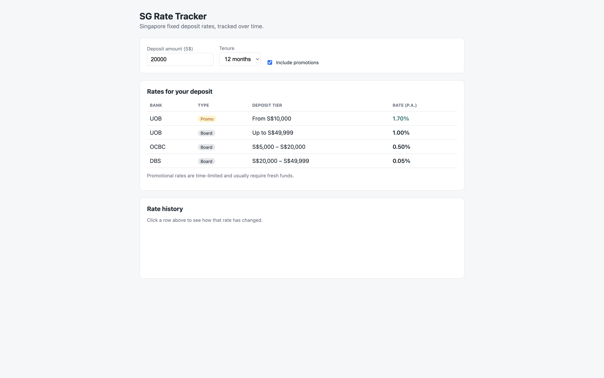
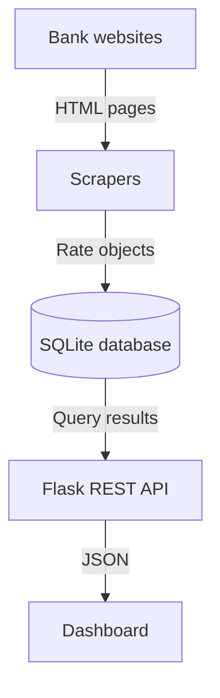

# SG Rate Tracker

Tracks and compares Singapore dollar fixed deposit rates from DBS, UOB and OCBC over time.

The scraper collects each bank's published rates on a schedule, stores every snapshot in SQLite, and serves them through a Flask REST API and an interactive dashboard where you can find the best rate for your deposit amount and see how rates have changed.



## Features

- **Scrapers for three banks**, built on a shared base class, covering standard (board) rates for DBS, UOB and OCBC, plus UOB's promotional rates
- **Full rate history** in SQLite, with every scrape stored rather than overwritten
- **REST API** for the latest rates and the history of any specific rate
- **Dashboard** that filters by deposit amount and tenure, ranks matching rates, toggles promotions on or off, and charts any rate's history
- **Responsible scraping**: checks each site's robots.txt before fetching, waits between requests and identifies itself honestly
- **Automated tests** for the parsing logic, database and API

## How it works



Each layer only talks to its neighbour, so any part can change without breaking the others:

- **Scrapers** (`scrapers/`) download and parse each bank's rates page into a common `Rate` format. `BaseScraper` handles fetching, robots.txt checks, delays and error handling; each bank's subclass only defines how to read its own page.
- **Database** (`database/db.py`) stores every scraped rate with a timestamp and answers queries for the latest rates and rate history.
- **API** (`api/app.py`) exposes the data as JSON endpoints.
- **Dashboard** (`api/templates/index.html`) calls the API from the browser and renders the table and chart.
- **Runner** (`run_scrapers.py`) runs every scraper and saves the results; this is the script that gets scheduled.

## Tech stack

Python · Requests · BeautifulSoup · SQLite · Flask · JavaScript · Chart.js · pytest

## Project structure

```
sg-rate-tracker/
├── scrapers/
│   ├── base_scraper.py     # Rate model and shared scraping logic
│   ├── dbs_scraper.py
│   ├── uob_scraper.py      # board and promotional rates
│   └── ocbc_scraper.py
├── database/
│   └── db.py               # SQLite storage and queries
├── api/
│   ├── app.py              # Flask API and dashboard route
│   └── templates/
│       └── index.html      # dashboard
├── tests/                  # pytest tests
├── run_scrapers.py         # runs all scrapers and saves results
├── requirements.txt
└── pytest.ini
```

## Getting started

**Requirements:** Python 3.9 or later.

```bash
git clone https://github.com/RaynaldCloud/sg-rate-tracker.git
cd sg-rate-tracker
python3 -m venv venv
source venv/bin/activate        # Windows: venv\Scripts\activate
pip install -r requirements.txt
```

**Collect rates:**

```bash
python3 run_scrapers.py
```

**Start the dashboard and API:**

```bash
flask --app api.app run --port 5001
```

Then open http://127.0.0.1:5001 in your browser. Each run of `run_scrapers.py` adds a new snapshot, building up the rate history.

## Scheduling

To collect rates automatically, schedule `run_scrapers.py` to run regularly. Twice a day is enough, since bank rates change at most daily.

**macOS / Linux (cron):** run `crontab -e` and add a line such as the following, replacing the paths with your own:

```
0 9,21 * * * cd /path/to/sg-rate-tracker && /path/to/sg-rate-tracker/venv/bin/python run_scrapers.py >> /path/to/sg-rate-tracker/logs/scraper.log 2>&1
```

**Windows:** use Task Scheduler to run `venv\Scripts\python.exe run_scrapers.py` with the project folder as the starting directory.

## API reference

| Endpoint | Description |
| --- | --- |
| `GET /api/health` | Health check |
| `GET /api/rates` | Latest rate for every bank, tenure and deposit tier, highest first. Optional: `?product=Fixed Deposit` |
| `GET /api/rates/history` | Full history for one rate. Required: `bank`, `product`. Optional: `tenure_months`, `min_deposit` |

Example:

```
/api/rates/history?bank=DBS&product=Fixed Deposit&tenure_months=12&min_deposit=1000
```

Invalid requests return JSON errors with appropriate status codes (400 for missing parameters, 404 for unknown routes).

## Running tests

```bash
pytest -v
```

The tests use small sample HTML instead of live websites, so they run in under a second and don't send traffic to the banks. They cover each bank's parsing quirks (such as tenure ranges, deposit tier boundaries and merged table cells), graceful handling of site outages and layout changes, the database queries, and the API's responses.

## Design decisions

- **Inheritance for scrapers.** Every bank shares the same fetching and error handling, but each site's layout is different, so each subclass only implements `parse()`. Adding a bank means writing one small class and adding it to the list in `run_scrapers.py`.
- **Store every snapshot.** Keeping all scrapes rather than overwriting them is what makes rate history possible.
- **Separate board and promotional rates.** Promotions usually require fresh funds and are time-limited, so they're flagged separately to keep comparisons fair.
- **Fail gracefully.** If one bank's site is down or changes its layout, that scraper logs the problem and returns nothing, while the others still run.
- **Parameterised SQL queries** throughout, to prevent SQL injection.

## Responsible scraping

The scrapers check each site's robots.txt before fetching, wait between requests, identify themselves with a descriptive User-Agent linking to this repository, and run only twice a day. They only access publicly available rate pages.

## Limitations and future improvements

- Scrapers depend on each bank's page layout and will need updating if a bank redesigns its site; failures are logged so breakages are easy to spot
- Only fixed deposits from three banks are covered so far. More banks can be added as new scraper classes
- Every run saves all rates even when unchanged; storing only changes would keep the history more compact
- Scheduling currently runs locally; moving it to an always-on server or a scheduled cloud job would make collection fully continuous

## Disclaimer

This is a personal project. Rates are collected automatically and may be incomplete or out of date; always confirm current rates and terms with the bank before making a deposit.

## Author

**Raynald Lim** · [LinkedIn](https://www.linkedin.com/in/raynald-lim/) · [GitHub](https://github.com/RaynaldCloud)
